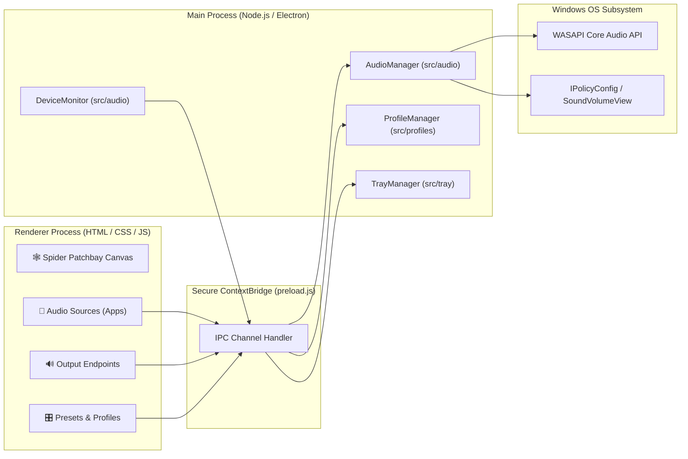

,# Noir 🎛️

> **Advanced Per-Application Audio Patchbay & System Router for Windows**

Noir gives you full control over your Windows audio subsystem with an interactive **Spider Connection Patchbay**, real-time WASAPI volume mixing, persistent presets, and a background system tray service.

---

## 🌟 Highlights

* 🕸️ **Spider Connection Patchbay**: Visual dual-column canvas with glowing SVG S-curve cables connecting your audio sources (apps) directly to output endpoints (headphones, speakers, USB DACs, Bluetooth).
* ⚡ **Interactive Cable Dragging**: Click and drag from any app port to plug the audio cable directly into your desired device socket.
* 🎚️ **Granular Low-Latency Mixing**: In-memory WASAPI session volume control and mute toggles with real-time VU level visualizers.
* 💾 **Persistent Audio Profiles**: Instant 1-click presets (*Gaming*, *Music & Focus*, *Work / Meetings*, *Cinema*) with custom profile snapshotting stored in `%APPDATA%/Noir/profiles.json`.
* 🔔 **System Tray Background Service**: Minimizes to tray, background radio preset switching, and auto-starts with Windows on login.
* 🔮 **Obsidian Glassmorphism**: Frameless, responsive desktop UI built with CSS custom properties, backdrop blurs, and spring micro-animations.

---

## 🏗️ Architecture



---

## 🚀 Getting Started

### Prerequisites
* **OS**: Windows 10 (1903+) or Windows 11 (x64)
* **Runtime**: [Node.js](https://nodejs.org/) v18+ and npm

### Installation & Local Development

```powershell
# 1. Clone repository
git clone https://github.com/RajX-dev/Noir.git
cd Noir

# 2. Install dependencies
npm install

# 3. Launch in development mode
npm run dev

# 4. Lint code
npm run lint

# 5. Build production executable / installer
npm run build
```

---

## 🎛️ Default Audio Profiles

| Profile | Target Routing | Volume Balance |
| :--- | :--- | :--- |
| **🎮 Gaming** | Games & Discord ➔ Headphones; Spotify & Browsers ➔ Speakers | Games 90%, Discord 100%, Music 45% |
| **🎵 Music & Focus** | Music Apps ➔ Headphones; Voice Chat ➔ Low/Muted | Music 100%, Chat 10% (Muted) |
| **💼 Work / Meetings** | Zoom, Teams, Discord, Meet ➔ Headset; Background ➔ Low | Meetings 95%, Media 25% |
| **🎬 Cinema / Media** | VLC, Netflix, YouTube, Video ➔ Speakers / HDMI | Surround 100%, Chat 30% |

---

## 📁 Project Structure

```text
Noir/
├── assets/
│   ├── icon.ico              # Windows application icon
│   └── tools/
│       └── SoundVolumeView.exe # NirSoft endpoint routing bridge
├── docs/                     # Architectural & Phase Documentation
│   ├── architecture.md       # System design & IPC data flow
│   ├── phases.md             # Development roadmap & phase tracking
│   ├── product-requirements.md
│   ├── tech-stack.md
│   └── visuals.md
├── src/
│   ├── audio/                # Audio engine (WASAPI & NirSoft bridge)
│   │   ├── audioManager.js   # High-level audio orchestrator
│   │   ├── deviceMonitor.js  # Real-time event polling
│   │   └── nativeBridge.js   # Native C++ mixer & process caller
│   ├── profiles/             # Presets & Profile system
│   │   └── profileManager.js # JSON disk serialization & rule matcher
│   ├── renderer/             # Frontend UI
│   │   ├── index.html        # Main window markup & Spider canvas
│   │   ├── js/
│   │   │   ├── app.js        # Main UI controller & cable drawing
│   │   │   ├── visualizer.js # VU level meter physics
│   │   │   └── notifications.js # Toast notifications
│   │   └── styles/
│   │       ├── main.css      # Design tokens & glassmorphism
│   │       └── components.css # Spider board, patchbay sockets, cards
│   ├── tray/                 # System Tray background manager
│   │   └── trayManager.js    # Tray icon & live radio profile menu
│   ├── utils/
│   │   └── windowState.js    # Multi-monitor bounds persistence
│   ├── main.js               # Electron main entry & single-instance lock
│   └── preload.js            # Secure contextBridge API
└── package.json
```

---

## 📄 License

MIT © [RajX-dev](https://github.com/RajX-dev)
