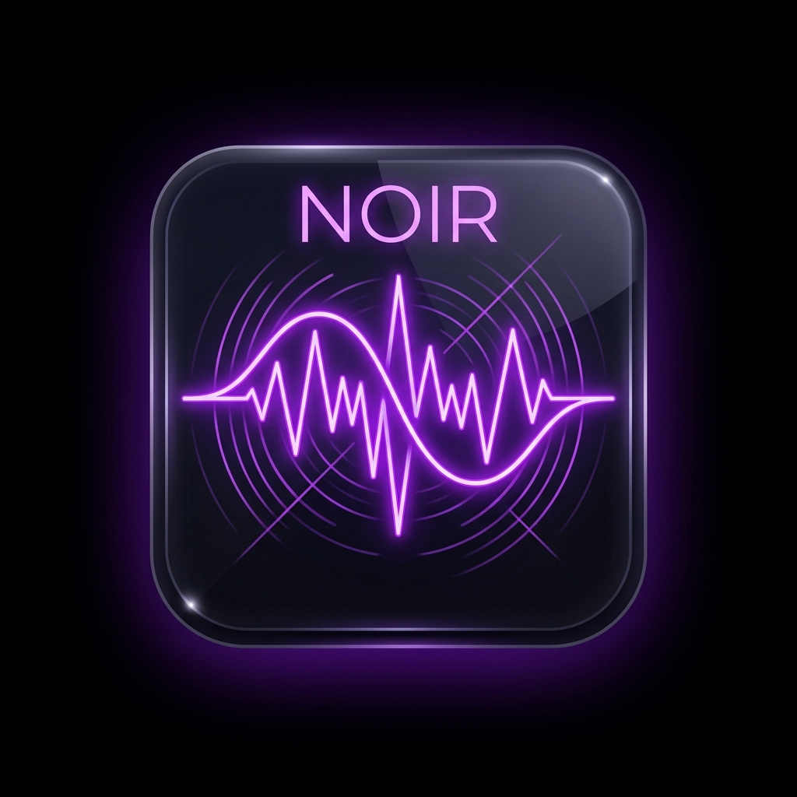
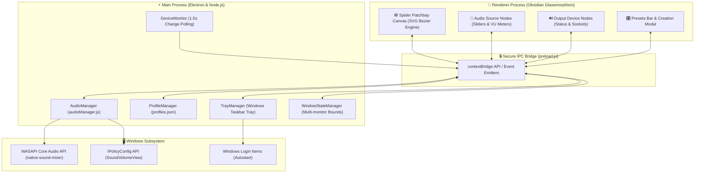

<div align="center">

  

  # 🎛️ NOIR

  ### **Advanced Per-Application Audio Patchbay & System Router for Windows**

  [](https://github.com/RajX-dev/Noir/releases/tag/v1.0.0)
  [](https://opensource.org/licenses/MIT)
  [](https://microsoft.com/windows)
  [](https://electronjs.org)

  <p align="center">
    <b>Noir</b> is a modern, obsidian glassmorphic audio control center for Windows that gives you real-time patchbay cable routing between individual applications and physical audio endpoints.
  </p>

  [Download Installer (.exe)](https://github.com/RajX-dev/Noir/releases/download/v1.0.0/Noir.Setup.0.1.0.exe) •
  [Download Portable (.exe)](https://github.com/RajX-dev/Noir/releases/download/v1.0.0/Noir.0.1.0.exe) •
  [Documentation](./docs/architecture.md)

</div>

---

## 🌟 Key Features

| Feature | Description |
| :--- | :--- |
| 🕸️ **Spider Connection Patchbay** | Dynamic glowing SVG cubic Bezier cables visually connect active applications to their assigned audio devices with animated audio particle flow. |
| ⚡ **Interactive Cable Dragging** | Drag connection cables directly from any app's port socket and plug them into output devices with live rubber-banding physics. |
| 🎚️ **Low-Latency WASAPI Mixing** | In-memory session volume control and instantaneous mute toggles powered by `native-sound-mixer`. |
| 📊 **Dynamic VU Level Meters** | Real-time animated multi-band VU meters dynamically scaled to session volume and mute status with decay physics. |
| 🏷️ **Hardware Disambiguation** | Distinguishes identical device types by their hardware adapter (e.g. *Headphones (Realtek)* vs *Headphones (USB DAC)*). |
| 💾 **Persistent Audio Profiles** | Instant 1-click presets (*Gaming*, *Music & Focus*, *Work / Meetings*, *Cinema*) with custom profile snapshotting stored in `%APPDATA%/Noir/profiles.json`. |
| 🔔 **System Tray Background Service** | Runs in the background, enables 1-click profile switching from the Windows taskbar tray context menu, and auto-starts with Windows. |
| 🔮 **Obsidian Glassmorphic UI** | Frameless, responsive desktop interface with curated dark color palettes, CSS custom properties, and smooth 60fps spring transitions. |

---

## 📸 Interface Preview

```
+---------------------------------------------------------------------------------------+
|  🎵 Noir Patchbay                                                    [⚙] [_] [□] [✕] |
+---------------------------------------------------------------------------------------+
|                                                                                       |
|   OUTPUT ENDPOINTS (3 active)                        AUDIO SOURCES (4 sessions)       |
|                                                                                       |
|   +--------------------------+                      +-------------------------------+ |
|   | 🎧 Headphones (Realtek)  |●- - - - - - - - - - -●| 🎯 VALORANT                   | |
|   |    Default · 2 apps      |   \                  |    [🎧 Headphones]  [ 🔊 90% ]| |
|   +--------------------------+    \                 +-------------------------------+ |
|                                    \                                                  |
|   +--------------------------+      \- - - - - - - -●| 💬 Discord                    | |
|   | 🎧 Headset (AKKORD-USB)  |                      |    [🎧 Headphones]  [ 🔊 100%]| |
|   |    USB · 1 app           |●                     +-------------------------------+ |
|   +--------------------------+ \                                                      |
|                                 \- - - - - - - - - -●| 🟢 Spotify                    | |
|   +--------------------------+                      |    [🎧 Headset USB] [ 🔊 45% ]| |
|   | 🔊 Speakers (Realtek)    |●                     +-------------------------------+ |
|   |    Speakers · 1 app      | \                    | 🌐 Chrome / YouTube           | |
|   +--------------------------+  \- - - - - - - - - -●|    [🔊 Speakers]    [ 🔊 50% ]| |
|                                                     +-------------------------------+ |
|                                                                                       |
+---------------------------------------------------------------------------------------+
|  PROFILES:  [ 🎮 Gaming (Active) ]  [ 🎵 Music & Focus ]  [ 💼 Work ]  [ ➕ New ]     |
+---------------------------------------------------------------------------------------+
```

---

## 🏗️ System Architecture



---

## 🎛️ Built-in Audio Profiles

| Preset | Target Device Mappings | Volume Defaults |
| :--- | :--- | :--- |
| **🎮 Gaming** | • Games (`Valorant`, `CS2`, `Steam`, `CoD`) ➔ **Headphones**<br>• Voice Chat (`Discord`, `TeamSpeak`) ➔ **Headphones**<br>• Media & Browsers (`Spotify`, `Chrome`) ➔ **Speakers** | Game: `90%`<br>Discord: `100%`<br>Music: `45%` |
| **🎵 Music & Focus** | • Music Apps (`Spotify`, `Tidal`, `Apple Music`) ➔ **Headphones**<br>• Communications (`Discord`, `Slack`, `Teams`) ➔ **Muted** | Music: `100%`<br>Chat: `10%` *(Muted)* |
| **💼 Work / Meetings** | • Conference Apps (`Zoom`, `Teams`, `Meet`, `Discord`) ➔ **Headset**<br>• Background Music ➔ **Speakers (Low)**<br>• Game processes ➔ **Muted** | Meetings: `95%`<br>Media: `25%`<br>Games: `0%` *(Muted)* |
| **🎬 Cinema / Media** | • Video Players (`VLC`, `Netflix`, `Prime`, `YouTube`) ➔ **Speakers / HDMI Soundbar**<br>• Background Voice Apps ➔ **Headphones (Low)** | Media: `100%`<br>Chat: `30%` |

---

## 🚀 Installation & Downloads

### Option A: Windows Installer (Recommended)
Download and run **[`Noir Setup 1.0.0.exe`](https://github.com/RajX-dev/Noir/releases/tag/v1.0.0)**. It will install Noir with desktop shortcuts, Start Menu integration, and a clean uninstaller.

### Option B: Portable Executable
Download **[`Noir 1.0.0.exe`](https://github.com/RajX-dev/Noir/releases/tag/v1.0.0)** to run Noir standalone with zero installation.

---

## 💻 Building from Source

### Prerequisites
* **Windows**: 10 (1903+) or 11 (x64)
* **Node.js**: v18.0.0 or higher
* **npm**: v9.0.0 or higher

### Steps

```powershell
# 1. Clone the repository
git clone https://github.com/RajX-dev/Noir.git
cd Noir

# 2. Install dependencies
npm install

# 3. Start development server
npm run dev

# 4. Run ESLint code verification
npm run lint

# 5. Build production executable & installer
npm run build      # Generates unpacked directory in dist/win-unpacked
npm run package    # Generates NSIS installer & portable .exe in dist/
```

---

## ⌨️ Shortcuts & Navigation

* **Tab / Shift+Tab**: Navigate between interactive app cards, sliders, and profile pills.
* **Arrow Left / Right**: Fine-tune volume levels in 5% increments.
* **Space / Enter**: Activate mute toggles, open device menus, or switch profiles.
* **Esc**: Dismiss active dropdowns or modals.
* **Click Tray Icon**: Toggle hide/show and focus Noir instantly.
* **Right-Click Tray Icon**: Open quick-switcher menu for background audio presets.

---

## 📁 Repository Structure

```text
Noir/
├── assets/
│   ├── icon.png              # Official Noir 512x512 app logo
│   └── tools/
│       └── SoundVolumeView.exe # NirSoft endpoint routing bridge
├── docs/                     # Comprehensive Architecture Documentation
│   ├── architecture.md       # Data flow & IPC contracts
│   ├── phases.md             # 6-phase development roadmap
│   ├── product-requirements.md # PRD & specs
│   ├── tech-stack.md         # Technology choices & rationale
│   └── visuals.md            # CSS tokens & design guidelines
├── src/
│   ├── audio/                # Audio Engine
│   │   ├── audioManager.js   # Device & session coordinator
│   │   ├── deviceMonitor.js  # Real-time event polling
│   │   └── nativeBridge.js   # Native C++ WASAPI wrapper
│   ├── profiles/             # Presets & Profile Engine
│   │   └── profileManager.js # JSON serialization in %APPDATA%/Noir/
│   ├── renderer/             # Frontend UI
│   │   ├── index.html        # Main window markup & Spider canvas
│   │   ├── js/
│   │   │   ├── app.js        # Main UI controller & cable drawing
│   │   │   ├── visualizer.js # VU level meter physics
│   │   │   └── notifications.js # Toast notifications
│   │   └── styles/
│   │       ├── main.css      # Design tokens & glassmorphism
│   │       └── components.css # Spider board & socket styling
│   ├── tray/                 # System Tray
│   │   └── trayManager.js    # Tray icon & live radio profile menu
│   ├── utils/
│   │   └── windowState.js    # Multi-monitor bounds persistence
│   ├── main.js               # Electron main process
│   └── preload.js            # Secure contextBridge IPC
├── LICENSE                   # MIT License
├── package.json
└── README.md
```

---

## 📄 License

Distributed under the **MIT License**. See [`LICENSE`](./LICENSE) for more information.

Developed with 💜 by [RajX-dev](https://github.com/RajX-dev).
